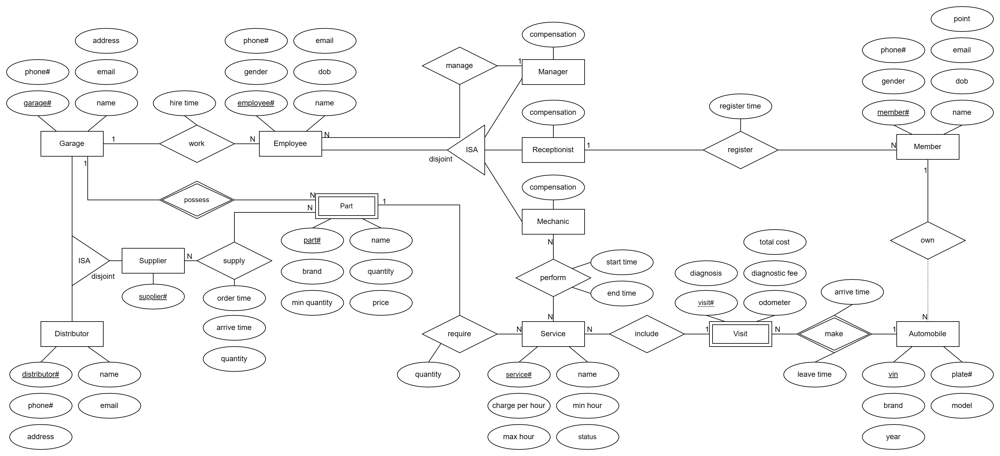
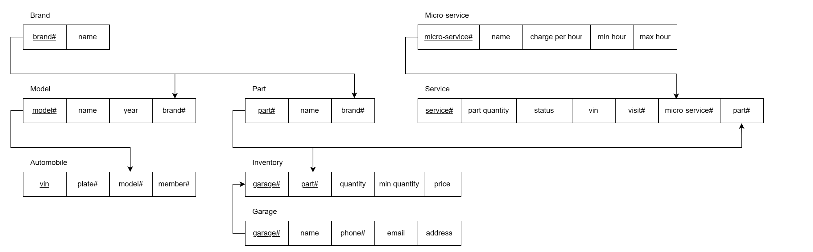

# Distributed database design for garage chain
## Introduction
### About the business
Consider a garage company with five centers distributed across the country. Recently, the company has experienced remarkable growth, marking a significant success. However, this expansion introduces new challenges, particularly in managing the rapidly increasing volume of data and scaling operations efficiently. Due to the distributed nature of the business, a centralized database is not an optimal solution. Instead, a distributed database system presents a compelling alternative. Here are the benefits it would offer the company:
- Enhanced Data Accessibility: A distributed database accessible by all sites would streamline record retrieval and information sharing. Mechanics and service advisors could access customer history, service records, and inventory data in real-time, improving response times and service quality.
- Improved Scalability: As the company expands its footprint, a distributed database system can seamlessly accommodate new sites and increased data volumes.
- Data Consistency and Integrity: A distributed system ensuring consistency across all sites. Data integrity is further bolstered by features like automatic backups and disaster recovery mechanisms.
### Business narratives
Every garage center is independently managed by a manager, a receptionist and at least five mechanics, and operates seven days a week from 8 AM to 9 PM, lunch break is from 12 AM to 2 PM. Additionally, managers and receptionists are paid a monthly salary while the mechanics are paid hourly based solely on the number of hours that he works on a vehicle (a maximum of 11 hours a day).  
For each car that comes for service, the system records its VIN – the vehicle identification number. That means the re-visited ones shall not be recorded again. The vehicle owners’ information is not required, unless they register to be members. Members may receive gratitude gifts, based on the points they gain from their visits (10$ charge equals to one point). 
Garage centers keep track of their own parts inventory. They record the name, current quantity, unit price, a threshold for the minimum quantity that must be present in the inventory. A part can be fetched from other centers or supplied by distributors. If the quantity for a part falls below the given threshold for any reason, the following ordering process is proceeded: 
1.	Calculate the desired quantity
2.	Check if any of the other centers has the part in sufficient quantity such that ordering the part from that center does not cause its inventory to fall below the minimum threshold.
3.	If one or more such centers are found, the parts should be obtained from the center with the largest available quantity.
4.	If no such center is found, the parts should be ordered from distributors.  

The organization has a predetermined set of services called micro-services, which only requires a specific part. The diagnosis service is compulsory for every visit, the customer then has the choice to repair or not. If the customer chooses to repair, a repair routine would be made corresponding to the diagnostic, consisting of several micro-services. The prescribed services later are assigned to several mechanics. The final charge is the total of all the micro-services’ labor cost and required parts’ price. Customers must pay the bill at the end of every visit.
| Micro-service      | Charge per hour | Average time |
|--------------------|-----------------|--------------|
| Diagnosis          | 0$ to 50$       | 0.25 hours   |
| Air filter change  | 50$             | 0.25 hours   |
| Battery replacement| 50$             | 0.25 hours   |
| Brake repair       | 50$             | 0.25 hours   |
| Engine oil change  | 50$             | 0.25 hours   |
## Global schema design
### ER diagram
-	Strong entities are Garage, Employee, Manager, Receptionist, Mechanic, Member, Automobile, Service, Supplier, Distributor. 
-	Weak entities:
    +	Visit: one Visit must be made by an Automobile. One Automobile can have many Visits.
    +	Part: one part must belong to a Garage. One Garage can possess many Parts.
-	Relationships and cardinality constraints:
    +	One Garage can have many Employees. One Employee works at only one Garage.
    +	One Manager can manage many Employees. One Employee is managed by one Manager.
    +	One Receptionist can register many Members. One Member is registered by one Receptionist.
    +	One Member can own many automobiles. One automobile can be owned by at most one Member.
    +	One Visit can include many Services. Each Service is associated with a Visit.
    +	One Service can be performed by many Mechanics. One Mechanic can perform many Services (not simultaneously).
    +	One Service requires one Part. One Part can be required in many Services.
    +	One Part is supplied by a supplier. One supplier can supply many Parts.
    +	A Supplier is either a Garage or a Distributor.  

### Relational schema

### Normalization

## Distribution design
### System architecture
The distributed database system shall be designed as a peer-to-peer architecture. This architecture will utilize a total of 5 sites strategically deployed across the garage centers. Each stores and manage sits own data.

### Fragmentation
#### 1. Primary horizontal fragmentation on relation GARAGE
Since each garage center stores and manages its own data, fragmentation shall start from the relation GARAGE using attribute *garage#*:
- GARAGE0 = σ(garage# = 0) GARAGE
- GARAGE1 = σ(garage# = 1) GARAGE
- GARAGE2 = σ(garage# = 2) GARAGE
- GARAGE3 = σ(garage# = 3) GARAGE
- GARAGE4 = σ(garage# = 4) GARAGE
#### 2. Derived horizontal fragmentation from relation GARAGE

## Implementation with MS SQL Server
<a href="https://learn.microsoft.com/en-us/sql/relational-databases/replication/tutorial-preparing-the-server-for-replication?view=sql-server-ver16" >1. Prepare server for replication</a>

<a href="https://learn.microsoft.com/en-us/sql/relational-databases/replication/tutorial-replicating-data-with-mobile-clients?view=sql-server-ver16" >2. Configure merge replication</a>

<a href="https://learn.microsoft.com/en-us/sql/relational-databases/linked-servers/create-linked-servers-sql-server-database-engine?view=sql-server-ver16">3. Create linked server</a>